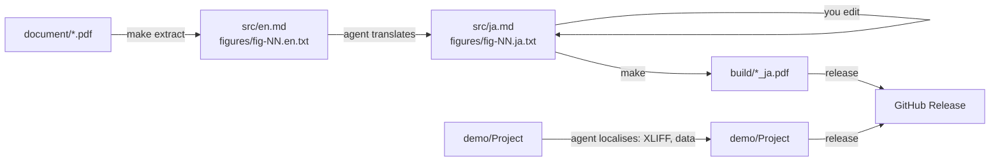

# 4D Technical Note Localisation

Template for translating a **4D technical note** (an English PDF) and **its companion 4D demo project**
into another language (Japanese by default), with GitHub Copilot doing the work and you making the
editorial decisions.

The PDF is never patched. It is **disassembled** into plain text, Markdown and figure label files.
You edit those, then **reassemble** the PDF with one command, as many times as you like.
Program code is copied byte for byte, and the build refuses to run if code was changed.



## Quick start

1. **Use this template** (on GitHub, *Use this template → Create a new repository*), then clone it.
2. Add the source material and push:
   - the English PDF → `document/<name>.pdf` (exactly one PDF)
   - the 4D project → `demo/<ProjectName>/` (the folder that contains `Project/`)
3. Start the agent. Use either:
   - **Locally** (Copilot CLI or the Copilot app, recommended): open the repository and prompt:
     > Localise this technical note and its demo into Japanese. Follow .github/copilot-instructions.md and stop at every checkpoint for my review.
   - **Cloud agent:** open an issue with the **Localisation request** form and assign it to Copilot.
     The agent works in a pull request. Reply in the PR to give directions at each checkpoint.
4. Review at each **checkpoint** (see below). Edit files directly or tell the agent what to change.
5. Release: tell the agent *"release v1.0.0"*, or run the steps under [Release](#release).

## Checkpoints: where you decide

The agent stops and asks you at each of these points:

| # | After | You review / decide |
|---|---|---|
| 1 | `make inspect` | Detected heading, code and caption styles in `technote.json`; target language; output style |
| 2 | `make extract` | `src/en.md` reads correctly (headings, code blocks, figures in the right places); OCR'd figure text |
| 3 | First translation | `src/ja.md`, `glossary.md`: terminology and tone |
| 4 | Figures | Contact sheets `build/contact-N.png`; which screenshots need a real localised screenshot |
| 5 | Demo data (optional) | Whether to replace the sample data (e.g. places) with local equivalents, and which ones |
| 6 | 4D project | Localisation plan: XLIFF scope, new attributes, UI behaviour |
| 7 | Release | Final PDF and demo; the repository README (from `.github/templates/README.technote.md`); version tag |

Edits are always safe. Generated output goes to `build/` only, and `make extract` never overwrites existing files.

## Files you edit

| File | What |
|---|---|
| `src/ja.md` | Translated body text (Markdown). Keep the block structure parallel to `src/en.md`. **Don't touch code blocks.** |
| `figures/fig-NN.ja.txt` | Text drawn in figure NN, one line per line of `fig-NN.en.txt` (see below) |
| `figures/layout/fig-NN.json` | Optional per-label tweaks (size, weight, alignment, position) |
| `figures/fig-NN-ja.png` | Optional ready-made replacement image (e.g. a screenshot of the localised app) |
| `glossary.md` | Terminology decisions. Change a term here first. |
| `technote.json` | Document settings (normally written once by the agent) |

### Figure text rules

Line N of `fig-NN.ja.txt` corresponds to line N of `fig-NN.en.txt`:

- **identical to the English line:** the original pixels are kept. Use this for code, numbers and identifiers.
- **empty:** the English text is erased and nothing is drawn (to merge two lines into one).
- **anything else:** the English text is erased and this text is drawn in its place.

Per-label overrides in `figures/layout/fig-NN.json` → `items[N]`:
`"scale": 1.2`, `"size": 28`, `"weight": "light"|"regular"|"bold"`, `"align": "left"|"center"`,
`"dx"`, `"dy"`, `"box": [x, y, w, h]`, `"bg"`, `"fg"`, `"erase_pad"`.
Per figure: `"localize": false` keeps the image unchanged; `"replace": "fig-NN-ja.png"` uses a ready-made image.

## Commands

| Command | Does |
|---|---|
| `make setup` | Create `.venv` and install Python packages |
| `make inspect` | Analyse the PDF and suggest `technote.json` (written only if not configured yet) |
| `make extract` | Disassemble the PDF (one time; never overwrites) |
| `make check` | Verify code blocks are unchanged and figure references match |
| `make figures` | Render localised figures into `build/figures/` |
| `make review` | Contact sheets comparing original and localised figures (`FIGS="02 05"` to select) |
| `make` | check → figures → PDF in `build/` |
| `make demo-zip` | Zip each committed 4D project in `demo/` into `build/<Name>.zip` |
| `make release-assets` | PDF + demo zips |
| `make clean` | Remove `build/` |

## Requirements

| | macOS (local) | Linux (cloud agent / Actions) |
|---|---|---|
| Python 3.10+ | ✓ | ✓ (preinstalled) |
| Google Chrome / Chromium | `/Applications/Google Chrome.app` | preinstalled on GitHub runners, or set `$CHROME` |
| Tesseract OCR | `brew install tesseract` | `apt install tesseract-ocr` |
| Japanese fonts for figures | Hiragino (built in) | `apt install fonts-noto-cjk` |
| tool4d (4D headless checks) | optional, `/Applications/tool4d/…` or `$TOOL4D` | not available, so 4D checks are skipped |

`.github/workflows/copilot-setup-steps.yml` prepares the Linux environment for the cloud agent.

> **Note:** figures and PDF text are rendered with Hiragino on macOS and Noto Sans CJK on Linux,
> so the two builds look slightly different. Build the final release on the platform you reviewed.

## Release

```sh
make release-assets                       # build/<name>_ja.pdf, build/<Demo>.zip
git tag v1.0.0 && git push origin v1.0.0
gh release create v1.0.0 build/*_ja.pdf build/*.zip --title "…" --notes "…"
```

Before the first release, the agent replaces this README with the converted document's own README, built from
`.github/templates/README.technote.md` (title, introduction, downloads, demo notes, differences, how to edit).
This usage guide then stays available in the template repository.

If you push a tag without creating the release yourself, `.github/workflows/release.yml` builds the assets
on Linux and publishes them. It skips the upload if the release already has assets.

## Layout

```
document/            original PDF (read-only)
src/                 en.md (extracted), ja.md (translation)
figures/             fig-NN.png, fig-NN.en.txt, fig-NN.ja.txt, layout/fig-NN.json
demo/<Name>/         4D project
data/                localised demo data (optional)
glossary.md          terminology
technote.json        document-specific settings
style/style.css      print stylesheet
tools/               pipeline (Python)
.github/             agent instructions, skills, workflows, templates/README.technote.md
build/               output (git-ignored)
```
